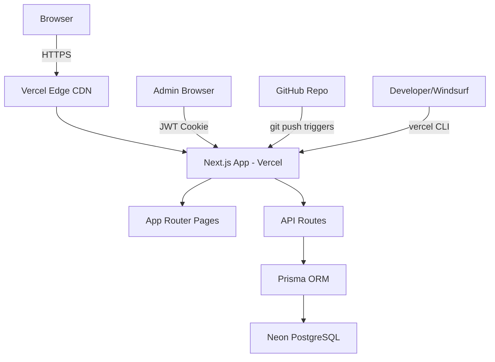

# Greenwood School - Project Documentation

## 1. UI Wireframes (ASCII)

### NAVBAR (all pages)
```
┌─────────────────────────────────────────────────────┐
│ 🏫 GREENWOOD SCHOOL    Home About Academics         │
│                        Activities Admissions Events  │
│                        Gallery Contact  [Register▶] │
└─────────────────────────────────────────────────────┘
```

### HOME PAGE
```
┌─────────────────────────────────────────────────────┐
│         HERO IMAGE (full width, dark overlay)        │
│    "Nurturing Minds Since 1995"  [Register Now]      │
├──────────┬──────────┬──────────┬────────────────────┤
│ 2500+    │ 150+     │ 28 Years │ CBSE               │
│ Students │ Teachers │Excellence│ Affiliated         │
├──────────┴──────────┴──────────┴────────────────────┤
│              LATEST NEWS & EVENTS                    │
│  [Event Card]  [Event Card]  [Event Card]            │
├─────────────────────────────────────────────────────┤
│              WHY GREENWOOD SCHOOL?                   │
│  [Feature]    [Feature]    [Feature]    [Feature]    │
└─────────────────────────────────────────────────────┘
```

### REGISTRATION FORM PAGE
```
┌─────────────────────────────────────────────────────┐
│            STUDENT REGISTRATION FORM                 │
│  Student Name*  [___________________]                │
│  Date of Birth* [___________________]                │
│  Class Applying*[LKG ▼             ]                │
│  Gender*        (●) Male  (○) Female (○) Other      │
│  Parent Name*   [___________________]                │
│  Phone*         [___________________]                │
│  Email*         [___________________]                │
│  Address*       [___________________]                │
│  Previous School[___________________]                │
│                 [  SUBMIT REGISTRATION  ]            │
└─────────────────────────────────────────────────────┘
```

### ADMIN DASHBOARD
```
┌───────────┬────────────────────────────────────────┐
│ SIDEBAR   │  STATS ROW                             │
│ Dashboard │  [Total:45] [Pending:12] [✓:28] [✗:5] │
│ Registr.  ├────────────────────────────────────────┤
│ Students  │  RECENT REGISTRATIONS TABLE            │
│ Events    │  Name | Class | Status | Date | Action │
│ Gallery   │  ─────┼───────┼────────┼──────┼─────── │
│ Staff     │  Arjun│  5   │ Pending│01/05 │✓ ✗ 🗑  │
│ [Logout]  │  Priya│  LKG │Approved│30/04 │✓ ✗ 🗑  │
└───────────┴────────────────────────────────────────┘
```

## 2. Tech Stack

| Layer | Technology | Version | Reason |
|---|---|---|---|
| Frontend | Next.js | 14.x | Full-stack, App Router, SSR |
| Language | TypeScript | 5.x | Type safety |
| Styling | Tailwind CSS | 3.x | Utility-first, fast |
| Database | PostgreSQL (Neon) | 15 | Free, serverless, scalable |
| ORM | Prisma | 5.x | Type-safe queries, migrations |
| Auth | jose (JWT) | 5.x | Lightweight, Edge compatible |
| Forms | react-hook-form | 7.x | Performant form handling |
| Notifications | react-hot-toast | 2.x | Simple toast system |
| Icons | lucide-react | latest | Clean icon set |
| Testing E2E | Playwright | 1.x | Cross-browser E2E |
| Testing Unit | Jest | 29.x | Standard unit testing |
| Hosting | Vercel | - | Free, auto-deploy, edge CDN |
| Repo | GitHub | - | Free, CI/CD trigger |

## 3. API Design

```
POST   /api/auth/login          { email, password } → { token }
POST   /api/auth/logout         {} → clears cookie
GET    /api/registrations       → all registrations [ADMIN]
POST   /api/registrations       { formData } → created registration
PUT    /api/registrations/[id]  { status } → updated [ADMIN]
DELETE /api/registrations/[id]  → deleted [ADMIN]
GET    /api/students            → all students [ADMIN]
POST   /api/students            { studentData } → created [ADMIN]
PUT    /api/students/[id]       { studentData } → updated [ADMIN]
DELETE /api/students/[id]       → deleted [ADMIN]
GET    /api/events              → all events (public)
POST   /api/events              { eventData } → created [ADMIN]
PUT    /api/events/[id]         { eventData } → updated [ADMIN]
DELETE /api/events/[id]         → deleted [ADMIN]
GET    /api/gallery             → all gallery items (public)
POST   /api/gallery             { item } → created [ADMIN]
DELETE /api/gallery/[id]        → deleted [ADMIN]
GET    /api/staff               → all staff (public)
POST   /api/staff               { staffData } → created [ADMIN]
PUT    /api/staff/[id]          { staffData } → updated [ADMIN]
DELETE /api/staff/[id]          → deleted [ADMIN]
POST   /api/contact             { contactData } → saved to DB
```

## 4. Architecture (Mermaid)



## 5. Database Schema (Prisma)

```prisma
model Registration {
  id           Int      @id @default(autoincrement())
  studentName  String
  dob          DateTime
  classApplying String
  gender       String
  parentName   String
  phone        String
  email        String   @unique
  address      String
  prevSchool   String?
  status       String   @default("pending")
  createdAt    DateTime @default(now())
}

model Student {
  id         Int      @id @default(autoincrement())
  name       String
  class      String
  section    String
  rollNo     String
  parentName String
  phone      String
  createdAt  DateTime @default(now())
}

model Event {
  id          Int      @id @default(autoincrement())
  title       String
  description String
  eventDate   DateTime
  category    String
  imageUrl    String?
  createdAt   DateTime @default(now())
}

model Gallery {
  id        Int      @id @default(autoincrement())
  albumName String
  imageUrl  String
  caption   String?
  category  String
  createdAt DateTime @default(now())
}

model Staff {
  id          Int      @id @default(autoincrement())
  name        String
  designation String
  department  String
  photoUrl    String?
  email       String
  createdAt   DateTime @default(now())
}

model Admin {
  id           Int      @id @default(autoincrement())
  email        String   @unique
  passwordHash String
  name         String
  createdAt    DateTime @default(now())
}

model Contact {
  id        Int      @id @default(autoincrement())
  name      String
  email     String
  phone     String
  message   String
  createdAt DateTime @default(now())
}
```
